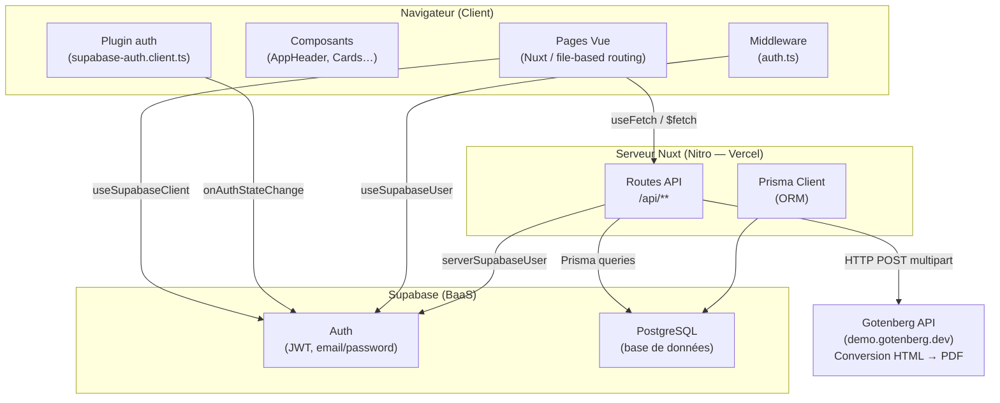
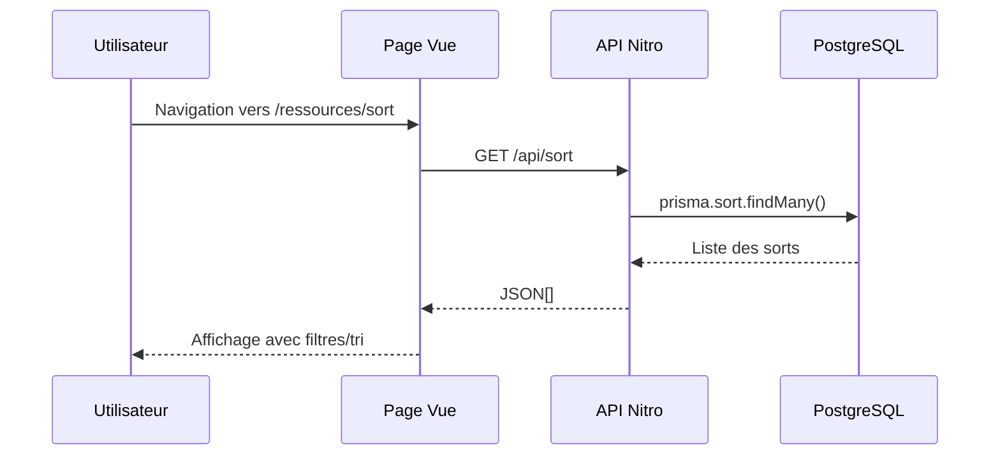
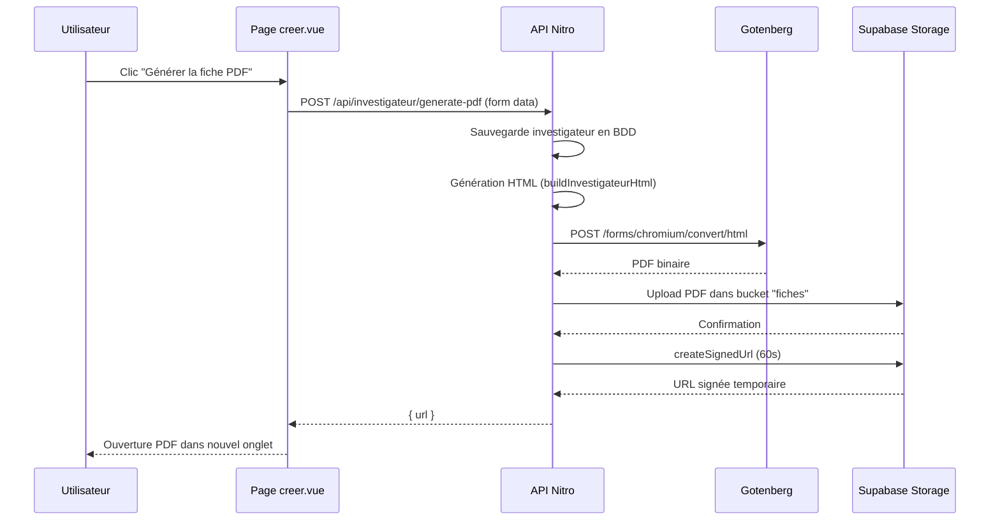
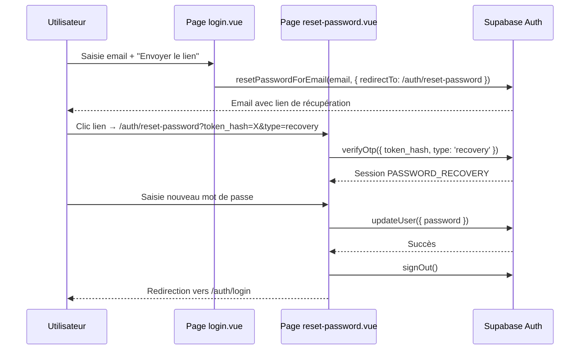

# Architecture applicative — Wicthu

## Vue d'ensemble

Wicthu est une application **full-stack** construite sur Nuxt 4, avec un rendu hybride (SSR + prerender), une API REST interne et Supabase comme backend-as-a-service.

---

## Schéma d'architecture logicielle

---

## Flux de données principaux

### 1. Consultation des ressources

### 2. Génération de fiche PDF

### 3. Authentification et reset de mot de passe

---

## Couches applicatives

| Couche | Rôle | Technologies |
|--------|------|-------------|
| **Présentation** | Rendu UI, interactions utilisateur | Vue 3, Nuxt UI, TailwindCSS |
| **Routage** | Navigation, protection des routes | Nuxt file-based routing, middleware auth |
| **État** | Données réactives locales | `ref`, `computed`, `useFetch` |
| **API** | Endpoints REST internes | Nitro (H3), file-based `/server/api/` |
| **Accès données** | Requêtes base de données | Prisma ORM |
| **Auth** | Sessions, JWT, emails | Supabase Auth |
| **Stockage** | Fichiers PDF temporaires | Supabase Storage |
| **PDF** | Conversion HTML → PDF | Gotenberg (Chromium headless) |

---

## Décisions architecturales

| Décision | Justification |
|----------|---------------|
| Nuxt 4 (full-stack) | Évite un projet backend séparé, API et frontend colocalisés |
| Prisma + Supabase | Prisma apporte le typage fort et les migrations, Supabase l'hébergement PostgreSQL et l'Auth clé-en-main |
| `redirect: false` (Supabase module) | Contrôle explicite des redirections auth via middleware custom |
| Gotenberg pour PDF | Démontre l'intégration d'API externe pour la présentation académique |
| Supabase Storage (PDF temporaire) | Les PDFs sont uploadés, une URL signée 60s est retournée, puis supprimés automatiquement |
