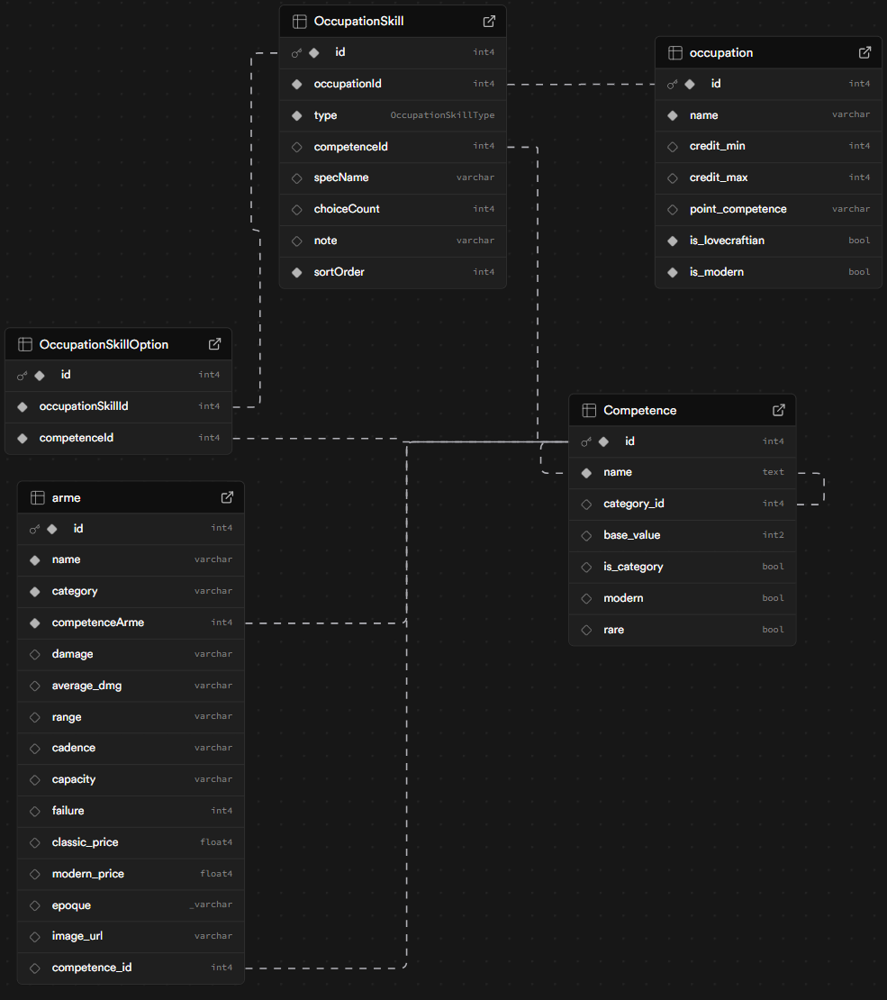
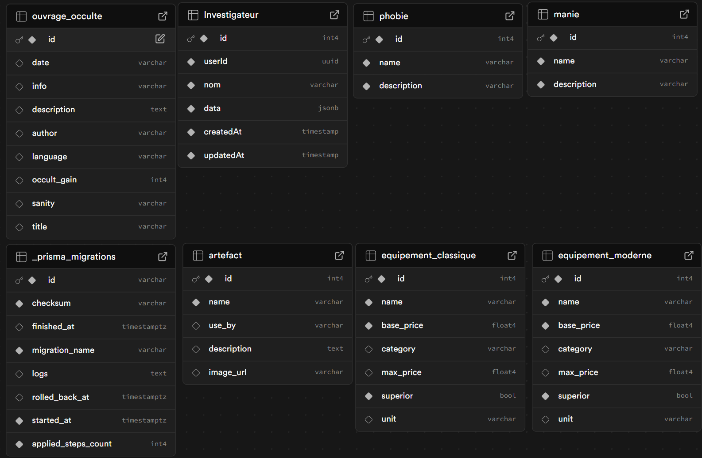
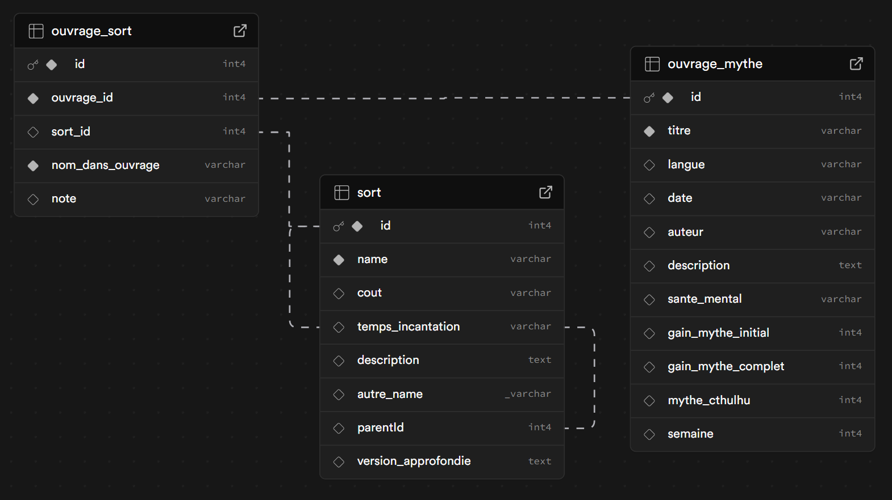
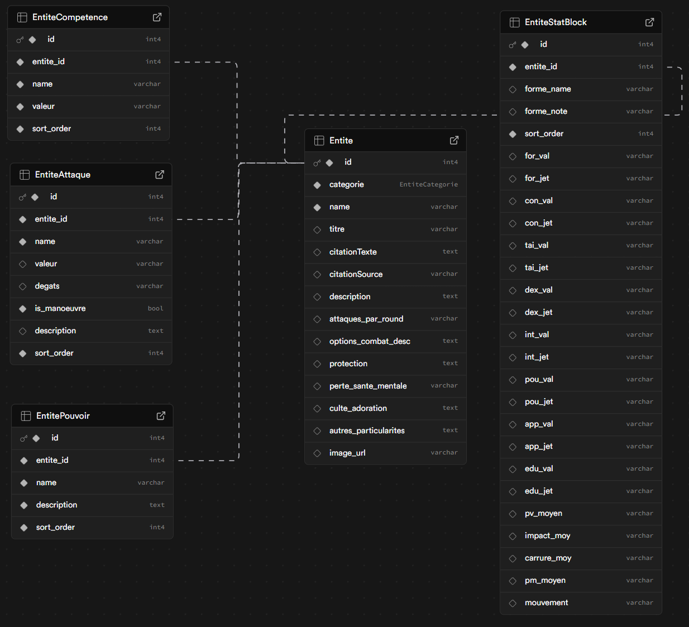

# Modèle de données — Wicthu

## Diagramme Entité-Relation

```mermaid
erDiagram

    %% ── COMPÉTENCES ──────────────────────────────────────────────
    Competence {
        int4    id          PK
        text    name
        int4    category_id FK
        int2    base_value
        bool    is_category
        bool    modern
        bool    rare
    }
    Competence ||--o{ Competence : "category_id → id (parent/enfants)"

    %% ── ARMES ────────────────────────────────────────────────────
    arme {
        int4    id              PK
        varchar name
        varchar category
        int4    competenceArme  FK
        varchar damage
        varchar average_dmg
        varchar range
        varchar cadence
        varchar capacity
        int4    failure
        float4  classic_price
        float4  modern_price
        varchar epoque
        varchar image_url
        int4    competence_id   FK
    }
    Competence ||--o{ arme : "competenceArme"
    Competence |o--o{ arme : "competence_id (optionnel)"

    %% ── ARTEFACTS ────────────────────────────────────────────────
    artefact {
        int4    id          PK
        varchar name
        varchar use_by
        varchar description
        varchar image_url
    }

    %% ── ÉQUIPEMENTS ──────────────────────────────────────────────
    equipement_classique {
        int4    id          PK
        varchar name
        varchar category
        float4  base_price
        float4  max_price
        varchar unit
        bool    superior
    }

    equipement_moderne {
        int4    id          PK
        varchar name
        varchar category
        float4  base_price
        float4  max_price
        varchar unit
        bool    superior
    }

    %% ── TRAUMATISMES ─────────────────────────────────────────────
    manie {
        int4    id          PK
        varchar name
        varchar description
    }

    phobie {
        int4    id          PK
        varchar name
        varchar description
    }

    %% ── OCCUPATIONS ──────────────────────────────────────────────
    occupation {
        int4    id               PK
        varchar name
        int4    credit_min
        int4    credit_max
        varchar point_competence
        bool    is_lovecraftian
        bool    is_modern
    }

    OccupationSkill {
        int4              id            PK
        int4              occupationId  FK
        OccupationSkillType type
        int4              competenceId  FK
        varchar           specName
        int4              choiceCount
        varchar           note
        int4              sortOrder
    }

    OccupationSkillOption {
        int4 id                 PK
        int4 occupationSkillId  FK
        int4 competenceId       FK
    }

    occupation ||--o{ OccupationSkill : "occupationId"
    OccupationSkill ||--o{ OccupationSkillOption : "occupationSkillId"
    Competence |o--o{ OccupationSkill : "competenceId (fixe)"
    Competence ||--o{ OccupationSkillOption : "competenceId (choix)"

    %% ── SORTS ────────────────────────────────────────────────────
    sort {
        int4     id                   PK
        varchar  name
        varchar  cout
        varchar  temps_incantation
        text     description
        text     version_approfondie
        _varchar autre_name
        int4     parentId             FK
    }
    sort |o--o{ sort : "parentId → id (parent/variantes)"

    %% ── OUVRAGES ─────────────────────────────────────────────────
    ouvrage_mythe {
        int4    id                  PK
        varchar titre
        varchar langue
        varchar date
        varchar auteur
        text    description
        varchar sante_mental
        int4    gain_mythe_initial
        int4    gain_mythe_complet
        int4    mythe_cthulhu
        int4    semaine
    }

    ouvrage_sort {
        int4    id               PK
        int4    ouvrage_id       FK
        int4    sort_id          FK
        varchar nom_dans_ouvrage
        varchar note
    }

    ouvrage_occulte {
        int4    id          PK
        varchar title
        varchar language
        varchar date
        varchar author
        varchar info
        text    description
        varchar sanity
        int4    occult_gain
    }

    ouvrage_mythe ||--o{ ouvrage_sort : "ouvrage_id"
    sort          |o--o{ ouvrage_sort : "sort_id (nullable)"

    %% ── ENTITÉS DU MYTHE ─────────────────────────────────────────
    Entite {
        int4    id                      PK
        varchar categorie
        varchar name
        varchar titre
        varchar citationTexte
        varchar citationSource
        text    description
        varchar attaques_par_round
        varchar options_combat_desc
        varchar protection
        varchar perte_sante_mentale
        varchar culte_adoration
        varchar entite_particularites
        varchar image_url
    }

    EntiteStatBlock {
        int4    id          PK
        int4    entite_id   FK
        varchar forme_name
        varchar forme_note
        int4    sort_order
        varchar for_val
        varchar con_val
        varchar tai_val
        varchar dex_val
        varchar int_val
        varchar pou_val
        varchar app_val
        varchar edu_val
        varchar pv_moyen
        varchar impact_moy
        varchar carrure_moy
        varchar pm_moyen
        varchar mouvement
    }

    EntitePouvoir {
        int4    id          PK
        int4    entite_id   FK
        varchar name
        text    description
        int4    sort_order
    }

    EntiteAttaque {
        int4    id           PK
        int4    entite_id    FK
        varchar name
        varchar valeur
        varchar degats
        bool    is_manoeuvre
        text    description
        int4    sort_order
    }

    EntiteCompetence {
        int4    id          PK
        int4    entite_id   FK
        varchar name
        varchar valeur
        int4    sort_order
    }

    Entite ||--o{ EntiteStatBlock   : "entite_id"
    Entite ||--o{ EntitePouvoir     : "entite_id"
    Entite ||--o{ EntiteAttaque     : "entite_id"
    Entite ||--o{ EntiteCompetence  : "entite_id"

    %% ── INVESTIGATEUR ────────────────────────────────────────────
    Investigateur {
        int4      id        PK
        varchar   userId
        varchar   nom
        json      data
        timestamp createdAt
        timestamp updatedAt
    }
```

---

## Schéma de base de données (Supabase)

---

## Énumérations

### `EntiteCategorie`

| Valeur | Signification |
|--------|---------------|
| `CREATURE_MYTHE` | Créatures du Mythe de Cthulhu |
| `DIVINITE_MYTHE` | Grands Anciens, Dieux Extérieurs |
| `HORREUR_TRADITIONNEL` | Vampires, loups-garous, etc. |
| `FAUNE` | Animaux réels ou semi-réels |

### `OccupationSkillType`

| Valeur | Signification |
|--------|---------------|
| `FIXED` | Compétence fixe imposée |
| `FIXED_SPEC` | Compétence fixe avec spécialité imposée |
| `FREE_SPEC` | Compétence fixe, spécialité libre |
| `CHOICE_FROM_LIST` | Choix parmi une liste de compétences |
| `FREE_CHOICE` | Compétence entièrement libre |

---

## Notes de conception

- **`Investigateur.data`** est un champ `json` libre : il stocke l'intégralité du formulaire de fiche (clés = noms de champs PDF). Ce choix évite de rigidifier le schéma pour un formulaire complexe de ~80 champs.
- **`EntiteStatBlock`** supporte les entités multi-formes via plusieurs enregistrements liés à la même `Entite` (ex : Shoggoth Seigneur possède une forme humaine et une forme monstrueuse).
- **`sort`** est auto-référencée (`parentId`) pour modéliser les variantes de sorts (parent → enfants). Le champ `autre_name` est un tableau PostgreSQL natif (`_varchar`).
- **`ouvrage_sort`** est une table de jointure enrichie entre `ouvrage_mythe` et `sort`, permettant d'indiquer le nom du sort tel qu'il apparaît dans l'ouvrage et d'y joindre des notes.
- **`Competence`** est auto-référencée (`category_id`) pour distinguer les catégories (nœuds) des compétences feuilles (`is_category = false`).
- Les colonnes `sort_order` sur les tables filles (`EntiteStatBlock`, `EntiteAttaque`, etc.) garantissent un affichage ordonné indépendamment de l'ordre d'insertion en base.
