# Modèle de données — Wicthu

## Diagramme Entité-Relation

```mermaid
erDiagram

    %% ── COMPÉTENCES ──────────────────────────────────────────────
    Competence {
        Int     id          PK
        String  name
        Int     categoryId  FK
        Int     baseValue
        Boolean isCategory
        Boolean rare
        Boolean modern
    }
    Competence ||--o{ Competence : "category / children"

    %% ── ARMES ────────────────────────────────────────────────────
    arme {
        Int     id              PK
        String  name
        String  category
        Int     competenceArme  FK
        String  damage
        String  average_dmg
        String  range
        String  cadence
        String  capacity
        Int     failure
        Float   classic_price
        Float   modern_price
        String  epoque
        String  image_url
        Int     competence_id   FK
    }
    Competence ||--o{ arme : "competenceArme"
    Competence |o--o{ arme : "competence_id (optionnel)"

    %% ── ARTEFACTS ────────────────────────────────────────────────
    artefact {
        Int    id          PK
        String name
        String use_by
        String description
        String image_url
    }

    %% ── ÉQUIPEMENTS ──────────────────────────────────────────────
    equipement_classique {
        Int     id          PK
        String  name
        String  category
        Float   base_price
        Float   max_price
        String  unit
        Boolean superior
    }

    equipement_moderne {
        Int     id          PK
        String  name
        String  category
        Float   base_price
        Float   max_price
        String  unit
        Boolean superior
    }

    %% ── TRAUMATISMES ─────────────────────────────────────────────
    manie {
        Int    id          PK
        String name
        String description
    }

    phobie {
        Int    id          PK
        String name
        String description
    }

    %% ── OCCUPATIONS ──────────────────────────────────────────────
    occupation {
        Int     id               PK
        String  name
        Int     credit_min
        Int     credit_max
        String  point_competence
        Boolean is_lovecraftian
        Boolean is_modern
    }

    OccupationSkill {
        Int    id            PK
        Int    occupationId  FK
        String type
        Int    competenceId  FK
        String specName
        Int    choiceCount
        String note
        Int    sortOrder
    }

    OccupationSkillOption {
        Int occupationSkillId FK
        Int competenceId      FK
    }

    occupation ||--o{ OccupationSkill : "skills"
    OccupationSkill |o--o{ OccupationSkillOption : "options"
    Competence |o--o{ OccupationSkill : "compétence fixe"
    Competence ||--o{ OccupationSkillOption : "compétence choix"

    %% ── SORTS ────────────────────────────────────────────────────
    sort {
        Int      id                  PK
        String   name
        String   cout
        String   temps_incantation
        String   description
        String   version_approfondie
        String[] autre_name
        Int      parentId            FK
    }
    sort |o--o{ sort : "parent / variantes"

    %% ── OUVRAGES ─────────────────────────────────────────────────
    ouvrage_mythe {
        Int    id                  PK
        String titre
        String langue
        String date
        String auteur
        String description
        String sante_mental
        Int    gain_mythe_initial
        Int    gain_mythe_complet
        Int    mythe_cthulhu
        Int    semaine
    }

    ouvrage_occulte {
        Int    id          PK
        String title
        String language
        String date
        String author
        String info
        String description
        String sanity
        Int    occult_gain
    }

    ouvrage_sort {
        Int    id               PK
        Int    ouvrage_id       FK
        Int    sort_id          FK
        String nom_dans_ouvrage
        String note
    }

    ouvrage_mythe ||--o{ ouvrage_sort : "sorts référencés"
    sort          |o--o{ ouvrage_sort : "sort (nullable)"

    %% ── ENTITÉS DU MYTHE ─────────────────────────────────────────
    Entite {
        Int    id                    PK
        String categorie
        String name
        String titre
        String citationTexte
        String citationSource
        String description
        String attaquesParRound
        String optionsCombatDesc
        String protection
        String perteSanteMentale
        String culteAdoration
        String autresParticularites
        String imageUrl
    }

    EntiteStatBlock {
        Int    id         PK
        Int    entiteId   FK
        String formeName
        String formeNote
        Int    sortOrder
        String forVal
        String conVal
        String taiVal
        String dexVal
        String intVal
        String pouVal
        String appVal
        String eduVal
        String pvMoyen
        String impactMoy
        String carrureMoy
        String pmMoyen
        String mouvement
    }

    EntitePouvoir {
        Int    id          PK
        Int    entiteId    FK
        String name
        String description
        Int    sortOrder
    }

    EntiteAttaque {
        Int     id           PK
        Int     entiteId     FK
        String  name
        String  valeur
        String  degats
        Boolean isManoeuvre
        String  description
        Int     sortOrder
    }

    EntiteCompetence {
        Int    id          PK
        Int    entiteId    FK
        String name
        String valeur
        Int    sortOrder
    }

    Entite ||--o{ EntiteStatBlock   : "blocs de stats (multi-formes)"
    Entite ||--o{ EntitePouvoir     : "pouvoirs distinctifs"
    Entite ||--o{ EntiteAttaque     : "attaques"
    Entite ||--o{ EntiteCompetence  : "compétences"

    %% ── INVESTIGATEUR ────────────────────────────────────────────
    Investigateur {
        Int      id        PK
        String   userId
        String   nom
        Json     data
        DateTime createdAt
        DateTime updatedAt
    }
```

---

## Énumérations

### `EntiteCategorie`

| Valeur | Signification |
|--------|---------------|
| `CREATURE_MYTHE` | Créatures du Mythe de Cthulhu |
| `DIVINITE_MYTHE` | Grands Anciens, Dieux Extérieurs |
| `HORREUR_TRADITIONNEL` | Vampires, loups-garous, etc. |
| `FAUNE` | Animaux réels ou semi-réels |

### `OccupationSkillType`

| Valeur | Signification |
|--------|---------------|
| `FIXED` | Compétence fixe imposée |
| `FIXED_SPEC` | Compétence fixe avec spécialité imposée |
| `FREE_SPEC` | Compétence fixe, spécialité libre |
| `CHOICE_FROM_LIST` | Choix parmi une liste de compétences |
| `FREE_CHOICE` | Compétence entièrement libre |

---

## Notes de conception

- **`Investigateur.data`** est un champ `Json` libre : il stocke l'intégralité du formulaire de fiche (clés = noms de champs PDF). Ce choix évite de rigidifier le schéma pour un formulaire complexe de ~80 champs.
- **`EntiteStatBlock`** supporte les entités multi-formes (ex: Seigneurs Shoggoths ont une forme humaine et une forme monstrueuse) via plusieurs enregistrements liés à la même `Entite`.
- **`sort`** est auto-référencée pour modéliser les variantes de sorts (parent → enfants).
- **`ouvrage_sort`** est une table de jointure enrichie entre `ouvrage_mythe` et `sort`, permettant d'indiquer le nom du sort tel qu'il apparaît dans l'ouvrage.
